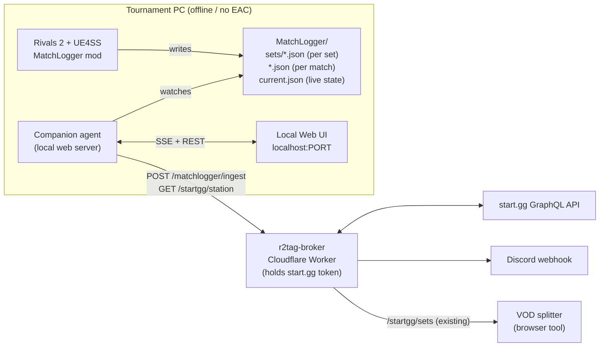

# MatchLogger ↔ start.gg ↔ VOD splitter — integration design

This document describes how to connect the Rivals of Aether II **MatchLogger**
UE4SS mod (`ue4ss/Mods/MatchLogger/`) to a live tournament: knowing which
station a machine is, pinging when a set ends, optionally reporting the set to
start.gg, and feeding precise timings to the
[VOD splitter](https://github.com/jugeeya/jugeeya.github.io/tree/main/vods).

## The core idea

Everything in the existing toolchain already joins on the same two coordinates:
**station number + wall-clock time**. The VOD splitter fetches sets from the
broker as `{ id, startedAt, completedAt, station, fullRoundText,
players:[{name, character}] }` and computes each clip as `startedAt −
recordingStart − pad`, filtered by station. start.gg is the source of
*identity* (who, which station, which round); the MatchLogger is the source of
*precise timing + characters + stats*. Tying them together just means giving
the MatchLogger the same two coordinates the rest of the system uses.

| Source          | Authoritative for                                          |
| --------------- | ---------------------------------------------------------- |
| **start.gg**    | set id, station, the two entrants, bracket round           |
| **MatchLogger** | frame-accurate set/match start & end, per-game characters, full stats (KOs, damage, parries, …) |
| **Join key**    | station + time window                                      |

## Components



The design keeps three concerns strictly separated:

- **The mod stays dumb and tournament-agnostic.** It writes JSON to disk and
  nothing else — no networking, no secrets, no station awareness. The same
  install works at any station.
- **The agent is the human-in-the-loop console.** It owns the station number,
  watches the files, talks to the broker, and renders the operator UI. All
  the ambiguous decisions (confirm a winner, correct an entrant mapping, push
  a report) live here.
- **The broker holds the secrets and does the network work.** The start.gg
  OAuth token and the Discord webhook never leave the Worker — the tournament
  PC only ever talks to the broker.

This is the same shape as the existing metrics project (mod → files → agent →
cloud) and the VOD splitter (browser → broker → start.gg).

## Data the mod already writes

`FinalizeSet()` in `main.lua` writes one file per set to `MatchLogger/sets/`:

```jsonc
{
  "setId": "20240115_143000",
  "complete": true,
  "startTime": "2024-01-15T14:30:00Z",       // character select entered
  "firstMatchStartTime": "2024-01-15T14:31:12Z",
  "endTime": "2024-01-15T14:43:05Z",
  "durationSeconds": 785,
  "winsRequired": 3,
  "matchCount": 4,
  "winnerSlot": 1, "winnerName": "…", "winnerCharacter": "clairen",
  "players": [ { "slot": 1, "name": "…", "character": "clairen", "wins": 3 }, … ],
  "matches": [ { "index": 1, "startTime": "…", "endTime": "…", "players": [ …full stats… ] }, … ]
}
```

### Mod additions needed

1. **Epoch timestamps.** The set report has ISO strings; the join with
   start.gg (`startedAt`/`completedAt` are epoch seconds) and with the VOD
   splitter is cleanest if the mod also emits `startEpoch` / `endEpoch`
   (`os.time()` is already computed internally). The agent could parse the
   `Z` ISO strings as UTC instead, but explicit epochs are less error-prone.

2. **A live-state file for "now playing".** To drive the UI's live station
   tracking — and, more importantly, to pre-bind entrant identity *before* a
   set ends — the mod overwrites a single `MatchLogger/current.json` at the
   hooks it already has:

   | Hook (existing)                | `current.json` becomes                              |
   | ------------------------------ | --------------------------------------------------- |
   | CharacterSelect → set start    | `{ "state": "set_start", "setId", "startEpoch" }`   |
   | VersusScreen → match start     | `{ "state": "match_start", "setId", "matchIndex" }` |
   | Results → match/set end         | `{ "state": "idle" }` (per-set file already written) |

   This is a small addition riding on hooks already in `main.lua`, and it is
   what makes identity matching reliable (see below).

## The agent (local web server)

A small local process — the recommended stack is a tiny HTTP server (Python
FastAPI/Flask or Node) serving a page styled with the same
`jugeeya.github.io` MD3 `styles.css`, launched from a tray icon that just
opens `localhost:PORT`.

### State

Held in a local JSON file or SQLite next to the agent:

```jsonc
{
  "config": { "brokerBaseUrl": "https://r2tag-broker.jdsambasivam.workers.dev",
              "eventSlug": "tournament/…/event/…",
              "station": 5 },
  "sets": [
    {
      "localId": 1,
      "ingestedAt": 1705330985,
      "modSet": { …the set json above… },
      "matchedStartggSetId": "12345678",
      "entrants": [ { "id": "…", "name": "…", "seed": 3 }, … ],
      "candidateWinnerEntrantId": "…",
      "confidence": "high | low | none",
      "status": "recorded | matched | notified | reported | error"
    }
  ]
}
```

### Responsibilities

- **Watch** `MatchLogger/sets/*.json` (new set) and `current.json` (live state).
- **On set start** (`current.json` → `set_start`): call the broker
  `/startgg/station` to fetch the entrants currently at this station, cache
  them, and show "now playing" in the UI.
- **On a new set file:** stamp the station, POST to `/matchlogger/ingest`,
  record the returned match + candidate winner + confidence, advance status.
- **Serve** the UI and push live updates over SSE.

### UI (localhost page)

- **Config row:** station selector (persists — the field that replaced
  `station.txt`), event slug, broker URL.
- **Now-playing panel:** live from `current.json` + the cached station
  entrants — "Station 5: [A] vs [B] — Winners R2".
- **Sets-recorded-today table:** one row per set, columns for time, players
  (character), score, matched start.gg round, and **status**. Ambiguous rows
  expose per-row actions: *confirm winner*, *fix entrant mapping*, *report to
  start.gg*.

## Broker endpoints

Existing:

- `GET /startgg/sets?slug=…` → completed sets for the VOD splitter (unchanged).

New:

- `GET /startgg/station?slug=…&station=N` → the set currently called/in
  progress at station N: `{ setId, fullRoundText, state, entrants:[{id, name,
  seed}] }`. Powers live tracking and pre-binding.
- `POST /matchlogger/ingest` → body `{ slug, station, set, entrants? }`.
  Matches the set (station + time window), computes a candidate winner +
  confidence, fires the Discord ping, returns the match result. **Read-only
  with respect to the bracket.**
- `POST /matchlogger/report` → body `{ slug, setId, winnerEntrantId,
  gameData? }`. Calls start.gg's `reportBracketSet` mutation. Only invoked
  from an explicit operator action (or auto, guarded — see below).

The start.gg token and Discord webhook stay server-side in the Worker.

## Identity matching — the hard part, and the rule

To report a score you must map the game-set to a start.gg set **and its
winner**.

- **Which set?** Broker queries the event for the set called at station N near
  the reported time. Station + time window is usually unique — the same
  assumption the VOD splitter and TSH already rely on.
- **Which entrant won?** Fragile: in-game names (Steam/display) do not
  reliably equal start.gg tags, so exact-match is unreliable. The fix is to
  **capture the two entrants at set start** (the `/startgg/station` call
  triggered by `current.json`), so by set end the pairing is known and the
  winner follows from side + score.

**Rule: notify + one-click confirm; never silently guess.** The ingest ping
always fires; an actual bracket write happens only when the operator confirms,
or (later) automatically *only* when identity is unambiguous (e.g. in-game
tags matched start.gg tags exactly). Reporting a wrong score to a live bracket
is worse than not reporting, so the system fails toward pinging a human.

## VOD splitter tie-in

start.gg's `startedAt`/`completedAt` are report/call times (loose). The
MatchLogger's are frame-accurate. Two low-cost wins:

- **Timing export:** the agent can emit a `sets[]` array in the exact shape
  the splitter already consumes (`{ startedAt, completedAt, station,
  fullRoundText, players:[{name, character}] }`) but with MatchLogger
  timestamps — tighter clips, auto-named by merging start.gg round text with
  MatchLogger characters.
- **Filename station stamp:** putting the station in the OBS recording
  filename (`Station5_2024-01-15 14-30-00.mkv`) lets the mod, the agent, and
  the splitter agree on station with no extra config, and the splitter can
  auto-select the station from the filename it already parses.

## Phasing

- **Phase 0 — agent skeleton + station.** Local web server, station selector,
  file watcher, "sets recorded today" table from the per-set files. No network
  yet. Unblocks everything, zero risk.
- **Phase 1 — ingest + ping.** `/matchlogger/ingest` → Discord ping on set
  end. Read-only w.r.t. start.gg.
- **Phase 2 — live tracking + confirm-report.** `current.json` mod addition +
  `/startgg/station` pre-binding; enrich the ping and the UI with real names /
  round; one-click report.
- **Phase 3 — guarded auto-report + timing export.** Auto-report only on
  unambiguous identity; MatchLogger→splitter timing export.

## Operational notes

- start.gg token and Discord webhook live only in the broker.
- Bracket writes default to operator confirmation.
- The anti-cheat/offline caveat from the mod README still applies — UE4SS only
  injects when the game runs without Easy Anti-Cheat.
